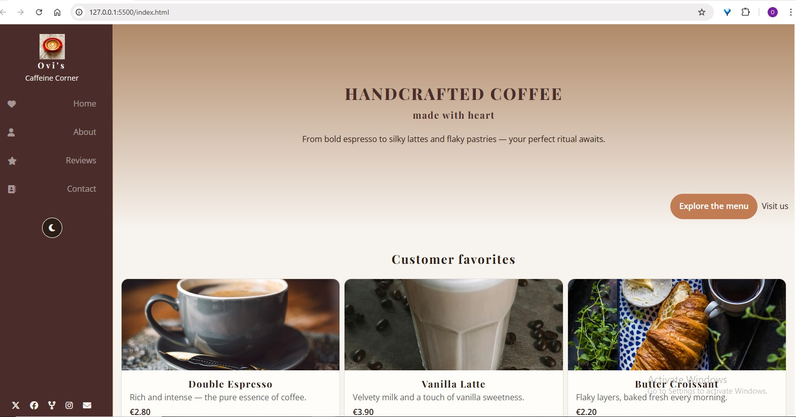

# Ovi’s Caffeine Corner — Landing Page ☕️

A responsive, accessible landing page for a specialty coffee shop with a sticky sidebar, semantic sections, and a dark mode that syncs with the OS (with user override).  
Built with **HTML/CSS/JS** — no build step.

---

## Table of Contents
- [Preview](#preview)
- [Features](#features)
- [Structure](#structure)
- [Getting Started](#getting-started)
- [Dark Mode](#dark-mode)
- [Responsive Behavior](#responsive-behavior)
- [Image Licensing](#image-licensing)
- [License](#license)

---

## Preview

## Features

Semantic sections: Hero, Menu, About, Testimonials, CTA, Footer

Sticky sidebar with brand, primary nav, social links, and theme toggle

Responsive grid layout and mobile-friendly sidebar

Design tokens (CSS custom properties) for palette, radius, shadows, spacing

Dark mode: OS-aware (prefers-color-scheme) + user override (persisted)

A11y: focus styles, hidden labels for icons, sensible heading hierarchy

Perf: lazy images, font preconnect, minimal JS

## Structure

index.html
sidebar_coffee_styles.css
script/darkmode.js
images/

## Getting Started
[https://ovigota.github.io/caffeine-corner/](https://ovigota.github.io/caffeine-corner/)

(Optional) `python -m http.server 8080` or `npx serve .`

## Dark Mode
- `.darkmode` is applied to `<html>`
- Pre-paint snippet in `<head>` prevents theme flash
- Keep layout tokens out of `.darkmode` (colors only)
- Since the sidebar is already dark due to the theme of page, I only apply the dark layout to the "main" section, the sidebar being left as it is.

## Responsive Behavior

- **Layout:** Fixed sidebar + flexible main (`display:flex`). Content area’s left margin tracks `--max_side_width`.
- **Cards:** `grid-template-columns: repeat(auto-fit, minmax(200px, 1fr))` → cards flow from 1 to many columns automatically.
- **About section:** 2-column by default → stacks to 1 column at `≤800px`.
- **Breakpoints:**
  - `≤768px`: `--max_side_width` → `180px`; nav text slightly smaller.
  - `≤500px`: `--max_side_width` → `60px`; brand text + nav labels hidden, icons centered; theme switch stays a 40×40 circle.
- **Dark mode:** Colors only—no layout vars in `.darkmode`, so responsive widths don’t change with theme.
- **Images:** Use `loading="lazy"` + fixed `width/height` to reduce CLS on mobile.

## Image Licensing
Images are from **Pexels**, used under the **Pexels License** (attribution appreciated, not required).
Footer includes: “Images courtesy of photographers on Pexels. Used under the Pexels License. No endorsement implied.”
`<link rel="license" href="https://www.pexels.com/license/">` is included in `<head>`.

## License
Code: MIT © Ovi  
Images: Pexels License

